# API Design Checklist - Document your API Contract

An API contract is a formal agreement between the API provider and the API consumer. It defines the expected behavior of the API including the endpoints, request/response formats, and error handling.

Your contract should be so thoroughly described that the API development team and client development teams (web devs, mobile devs, other internal teams, etc.) can begin developing their clients and the API *before the API has been developed*.

Design effort and simplicity of user experience are inversely related.

The achieve a simple API UX, you need to put in a lot of API design effort. Changes to the contract

OpenAPI, formerly known as Swagger, is a specification for documenting HTTP APIs, including REST APIs.

## Document your API contract

**Principle:** include as much detail as you can in your OpenAPI spec so that

1. Users can understand your endpoints without needing to hit the API
2. Client and server code generated from the OpenAPI spec has good
   1. autocompletion - for **types** and **descriptions**
   2. function and model names
   3. organization, i.e. functions are grouped

Use OpenAPI to document your API. Include:

- [ ] API-level metadata
  - [ ] A title
  - [ ] A client-facing, markdown description of the API that does not expose imlementation details
  - [ ] API version (ideally the semantic version)
  ```python
  app = FastAPI(
      title="Pet Store API",
      description="Update and retrieve pet information",
      version=__version__  # e.g. "0.1.0"
  )
  ```

- [ ] For every **API route**
  - [ ] Add a client-facing markdown docstring that does not discuss internal implementation details. [FastAPI guide](https://fastapi.tiangolo.com/advanced/path-operation-advanced-configuration/#advanced-description-from-docstring)
  - [ ] Document the request inputs
    - [ ] Payload (if applicable for the HTTP method), [FastAPI guide](https://fastapi.tiangolo.com/tutorial/body/)
    - [ ] Query parameters, [FastAPI guide](https://fastapi.tiangolo.com/tutorial/query-params-str-validations/)
    - [ ] Request headers, [FastAPI guide](https://fastapi.tiangolo.com/tutorial/header-params/)
  - [ ] For every response HTTP status code [FastAPI guide](https://fastapi.tiangolo.com/advanced/additional-responses/), [OpenAPI guide](https://swagger.io/docs/specification/describing-responses/)
    - [ ] Document the response model(s)
    - [ ] Document notable response headers
    - [ ] Document the content ([MIME](https://developer.mozilla.org/en-US/docs/Web/HTTP/Basics_of_HTTP/MIME_types/Common_types)) type(s)
    - [ ] Include at least one example response
      ```python
      class PutFileResponse(BaseModel):
          """Response model for `PUT /files/:filePath`."""
          success: bool
          message: str
      
          model_config = ConfigDict(
            json_schema_extra={"examples": [
              {"success": True, 
              "message": "File uploaded successfully"}]
            }
          )
      ```

- **Schemas** (pydantic models in request/response)
  - [ ] Decide if you will use `snake_case` or `camelCase` in JSON request/response payloads. 
    - Be consistent and stick to one
    - Useful: `pydantic.alias_generators.to_camel` in `model_config`, [Pydantic guide](https://docs.pydantic.dev/latest/api/config/#pydantic.config.ConfigDict.loc_by_alias)
  - [ ] Include a docstring in each Pydantic Model
    ```python
    class PutFileResponse(BaseModel):
        """Response model for `PUT /files/:filePath`."""
    ```
  - [ ] Include a description for each field 
    ```python
    Field(..., description="...")
    ```
- [ ] Give each endpoint a unique "operation ID". This influences the function name in the generated client/server code. [FastAPI Guide 1](https://fastapi.tiangolo.com/advanced/path-operation-advanced-configuration/#using-the-path-operation-function-name-as-the-operationid)
  ```python
  @app.get("/files/{file_path}", operation_id="get_file")
  def get_file(file_path: str):
      ...
  ```
- [ ] Use tags to group endpoints. Influences the module/folder functions are grouped in in the generated client/server code.
  ```python
  ROUTER = APIRouter(tags=["files"])

  ROUTER.get("/files/{file_path}", ...)
  def get_file(file_path: str):
      ...
  ```
- [ ] If you are going to put version numbers in your routes, do NOT use full semantic versions, e.g. `GET /v1.0.0/files`. This would require to you to update your routes at each release, which requires a code change in all existing API clients. Instead, prefer the major version number only, e.g. `GET /v1/files`. There are pro's and con's to declaring routes in code vs. at the API Gateway level.
- [ ] **(not covered in this section)** Keep base URLs stable, e.g. use a registered domain name rather than an autogenerated AWS-created URL


# Trunk-based Development workflow for detecting breaking API changes

`oasdiff` is a tool that can diff two `openapi.json` schema files and detect breaking changes.

```mermaid
stateDiagram
    s1 : create branch from main
    s2 : make changes to FastAPI in<br/>any of src/**/*.py
    s3 : regenerate openapi.json<br/>to reflect your changes
    s4 : commit openapi.json
    s5 : pass linting and <br/>tests, push, and<br/>open a PR to main
    s6 : CI is triggered
    s7 : CI regenerates the openapi.json<br/>from the code on the feature branch
    s8 : CI checks to see if the generated<br/>openapi.json is same as committed
    s9 : retrieve main/openapi.json
    s10 : CI executes oasdiff comparing<br/>main/openapi.json to feat/branch/openapi.json
    s11 : the build passes ✅
    s12 : the build fails ❌
    s13 : 💬 Decide if breaking changes are<br/>intentional and clients have had<br/>sufficient warning
    s15 : merge the PR! 🎉

    s1 --> s2
    s2 --> s3
    s3 --> s4
    s4 --> s5
    s5 --> s6
    s6 --> s7
    s7 --> s8
    s8 --> s3 : if no, then you<br/> didn't do this step.<br/>Go do it!
    s8 --> s9 : if yes
    s9 --> s10
    s10 --> s11 : if no breaking <br/>changes detected
    s10 --> s12 : if breaking changes detected
    s11 --> s15
    s12 --> s13
    s13 --> s15 : if yes, then override
    s13 --> s2 : if no, go back and<br/>fix the breaking changes
    s15 --> [*]


```

